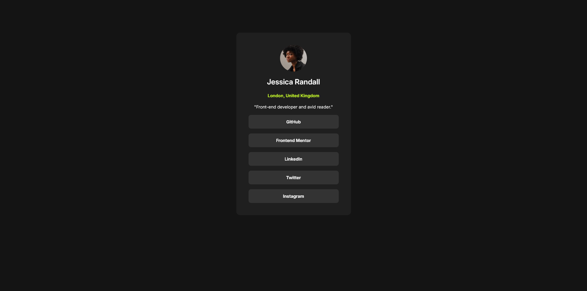
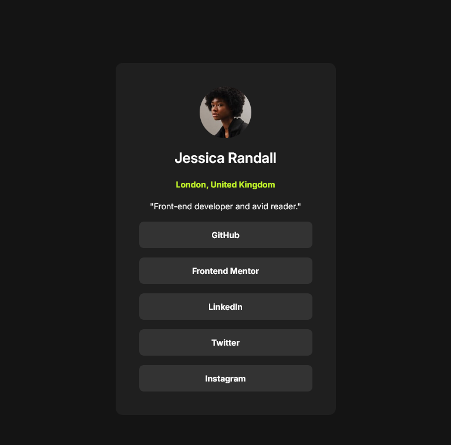
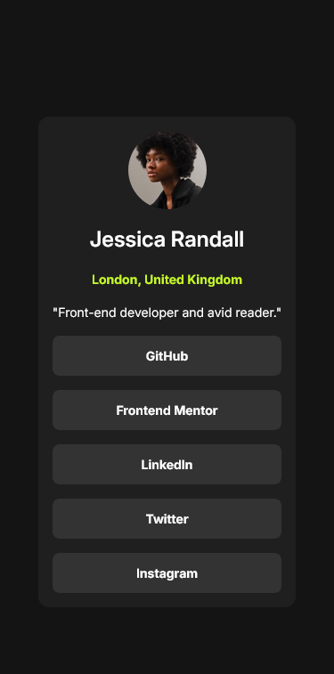

# Frontend Mentor - Social links profile solution

This is a solution to the [Social links profile challenge on Frontend Mentor](https://www.frontendmentor.io/challenges/social-links-profile-UG32l9m6dQ). Frontend Mentor challenges help you improve your coding skills by building realistic projects. 

## Table of contents

- [Overview](#overview)
  - [The challenge](#the-challenge)
  - [Screenshot](#screenshot)
  - [Links](#links)
- [My process](#my-process)
  - [Built with](#built-with)
  - [What I learned](#what-i-learned)
  - [Continued development](#continued-development)
- [Author](#author)

## Overview

### The challenge

Users should be able to:

- See hover and focus states for all interactive elements on the page

### Screenshot

### Links

- Solution URL: [https://github.com/CodeNautique/Social-links-profile]
- Live Site URL: [https://social-links-profile-eta-sooty.vercel.app/]

## My process

### Built with

- Semantic HTML5 markup
- CSS custom properties
- Flexbox
- Mobile-first workflow

### What I learned

I sharped my skills in coding in HTML and CSS, I developed this project very fast around 1h30min using figma to like a front-end developer do.

### Continued development

I have some difficulties to stick perfectly to the design, to  size the card perfectly and see no difference with the design. (see my others projects)

## Author

- Website - [Tomy](https://www.your-site.com)
- Frontend Mentor - [@CodeNautique](https://www.frontendmentor.io/profile/CodeNautique)
- Twitter - [@idev_cloud](https://www.x.com/@idev_cloud)
